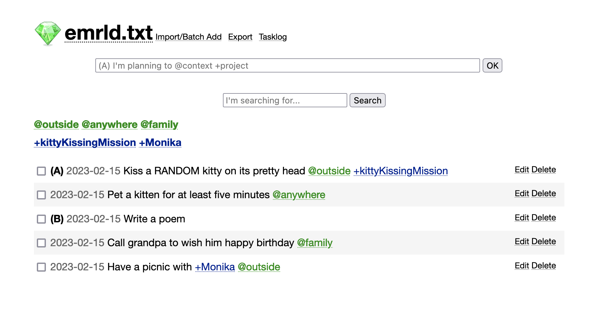

# emrld.txt

emrld.txt is a simple self-hosted to-do list web app compatible with [todo.txt](http://todotxt.org/) format.



# Advantages

- Simple, minimalistic, and lightweight
- Contexts and projects with filtering
- Keyword search
- Tasklog with all completed tasks. Completed tasks can be purged in one click
- Batch add tasks/import
- Export
- Offline-friendly local deploy (duh!)

# Deploy and run

Run in one line

```bash
docker run -d -p 3000:3000 -e RAILS_ENV=production -e SERVER_HOST_NAME=your.domain alxwnth/emrld.txt:0.1.1 /bin/bash -c "bundle exec rake db:migrate && bundle exec puma -C config/puma.rb"
```

The same can be done with Docker Compose (see `docker-compose.yml`).

## Running behind Nginx reverse proxy

Here's a sample no-pain Nginx starter template:

```nginx
server {

    server_name your.domain;

    location / {
        proxy_pass http://localhost:3001/;
        proxy_set_header X-Forwarded-Proto https;
        proxy_set_header X-Forwarded-Ssl on;
        proxy_set_header Host $host;
    }
}
```

## Local deploy with Docker

```
docker run -d -p 3001:3000 -e SERVER_HOST_NAME=localhost alxwnth/emrld.txt:0.1.1 /bin/bash -c "bundle exec rake db:migrate && bundle exec puma -C config/puma.rb"
```

After that your instance will be available on http://localhost:3000

## Local No-Docker deploy with Puma

```bash
bundle exec rake db:migrate
bundle exec puma -C config/puma.rb
```

After that your instance will be available on http://localhost:3000

To run Puma on a remote server with domain and Nginx, you'll need to specify production environment and pass the domain name as follows (don't forget the migation!):

```
bundle exec rake db:migrate
RAILS_ENV=production SERVER_HOST_NAME=localhost bundle exec puma -C config/puma.rb
```

# To Do

- [ ] Night mode
- [ ] Proper mobile version
- [ ] Combining project and context tags
- [ ] More advanced search
- [ ] Due dates
- [ ] Markdown links
- [ ] Encryption
- [ ] Keyboard-based workflow